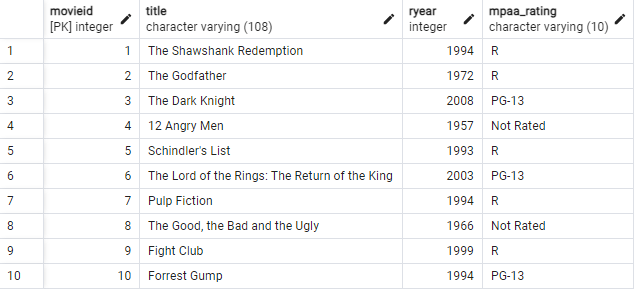
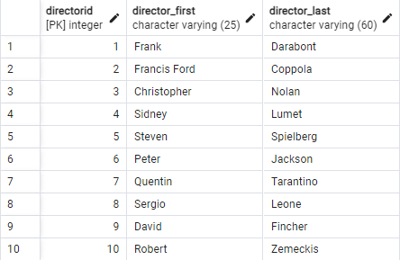
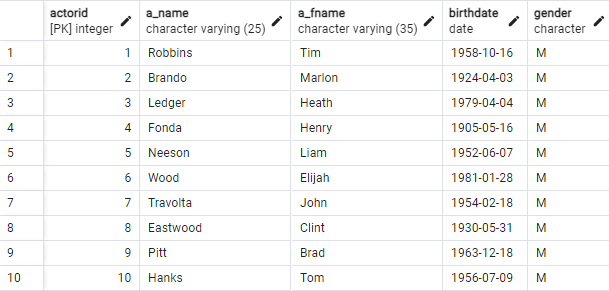
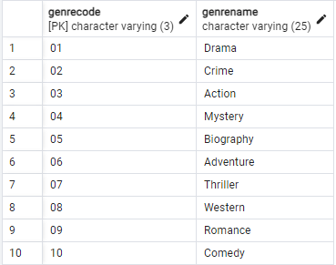
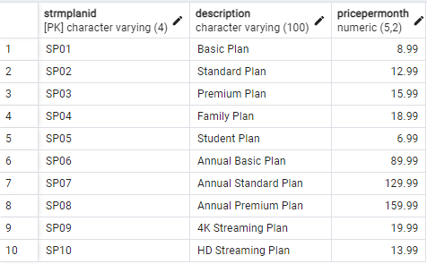
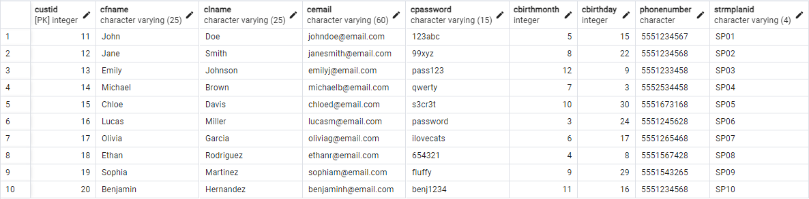
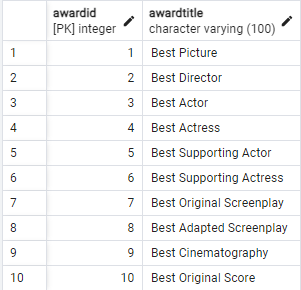

# PostgreSQL Netflix Scenario

This repository contains a database management system project for the "CSE 3139 Database Management Systems" course, simulating a Netflix scenario. The project includes ER diagrams, SQL table creation scripts, important queries, and a detailed project report.

## Table of Contents
- [Introduction](#introduction)
- [Project Description](#project-description)
- [Project Structure](#project-structure)
- [Setup](#setup)
- [Usage](#usage)
- [Database Tables](#database-tables)
  - [Movies Table](#movies-table)
  - [Directors Table](#directors-table)
  - [Actors Table](#actors-table)
  - [Genres Table](#genres-table)
  - [Streaming Plans Table](#streaming-plans-table)
  - [Customers Table](#customers-table)
  - [Awards Table](#awards-table)
- [Important Queries](#important-queries)
- [ER Diagram](#er-diagram)
- [Project Report](#project-report)
- [Contributors](#contributors)
- [License](#license)

## Introduction

This repository includes a comprehensive database project simulating a Netflix scenario. It demonstrates the creation of tables, establishment of relationships, and execution of complex queries in PostgreSQL. The project aims to provide practical experience with database management systems and enhance understanding of database design principles.

## Project Description

The project involves designing and implementing a database for a Netflix-like scenario. It covers the creation of necessary tables, defining relationships, and executing important queries to retrieve relevant information from the database. The database structure is visualized through an ER diagram, and detailed documentation is provided in the project report.

## Project Structure

The project files are organized as follows:

```bash
/PostgreSQL-Netflix-Scenario
│
├── E-R Diagram.png
├── Database-Netflix-Scenario.pdf
├── important queries
│   ├── 1.png
│   ├── 2.png
│   ├── ...
│   ├── 10.png
│   └── queries.txt
└── Tables
    ├── actor-table.png
    ├── awards-table.png
    ├── ...
    └── strmplan-table.png
```

## Setup

To set up the project, follow these steps:

1. **Clone the repository**:
    ```bash
    git clone https://github.com/yourusername/PostgreSQL-Netflix-Scenario.git
    cd PostgreSQL-Netflix-Scenario
    ```

2. **Install PostgreSQL** if not already installed. Follow the instructions [here](https://www.postgresql.org/download/).

3. **Create the Database**:
    ```sql
    CREATE DATABASE netflix_scenario;
    ```

4. **Run the SQL Scripts** to create tables and insert data:
    ```bash
    psql -d netflix_scenario -f Tables/queries.txt
    ```

## Usage

To use the database and run queries, follow these steps:

1. **Connect to the Database**:
    ```bash
    psql -d netflix_scenario
    ```

2. **Execute Queries**: You can execute the queries provided in the `important queries` folder either through the PostgreSQL command line or a database management tool like pgAdmin.

## Database Tables

### Movies Table



The Movies table stores information about movies, including their titles, release years, and MPAA ratings.

### Directors Table



The Directors table stores information about directors, including their first and last names.

### Actors Table



The Actors table stores information about actors, including their names, birthdates, and genders.

### Genres Table



The Genres table stores information about movie genres.

### Streaming Plans Table



The Streaming Plans table stores information about different subscription plans.

### Customers Table



The Customers table stores information about customers, including their names, email addresses, and subscription plans.

### Awards Table



The Awards table stores information about awards given to movies.

## Important Queries


The `important queries` folder contains SQL scripts for various complex queries. These queries demonstrate how to retrieve specific information from the database, such as the highest-rated films, the directors with the most awards, and the customers who watch the most films in each genre.

## ER Diagram


The ER diagram visualizes the database structure, showing the entities, attributes, and relationships between them.

## Project Report

For detailed information about the project, you can view the [project report](https://github.com/FurkanBaytak/PostgreSQL-Netflix-Scenario/blob/main/Database-Netflix-Scenario.pdf).

## Contributors

- [Furkan Baytak](https://github.com/FurkanBaytak)
- [Furkan Özkaya](https://github.com/Elhier0)
- [Sıla Naz Aslan](https://github.com/silanazaslan)

## License

This project is licensed under the MIT License. See the [LICENSE](LICENSE) file for details.

